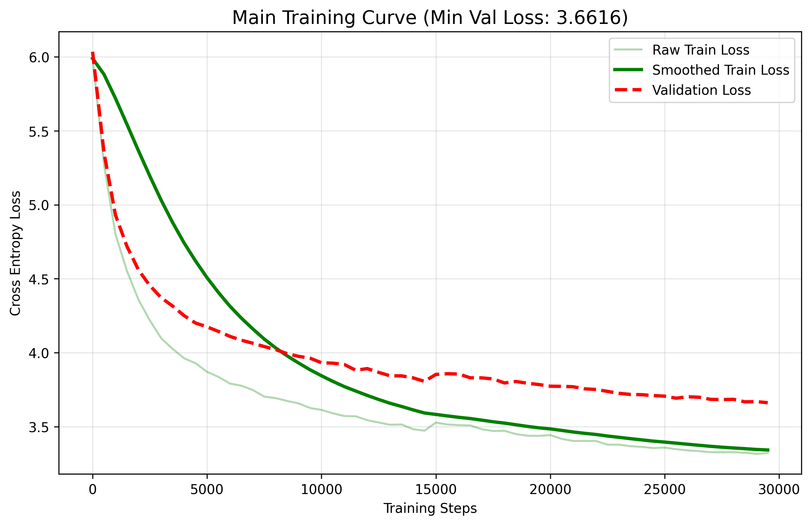
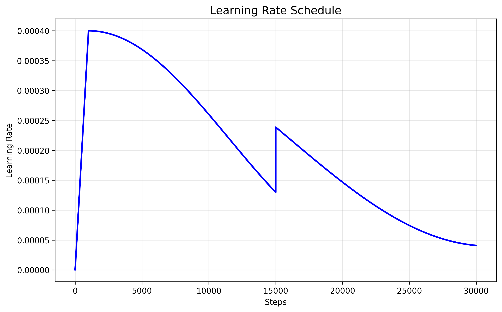
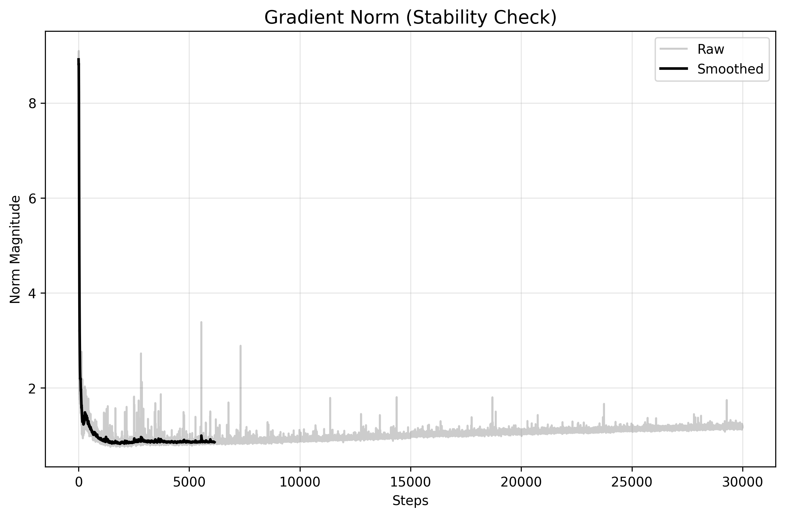

# 🏥 VitalLM-50M: Medical-Domain Small Language Model

<p align="center">
  <a href="https://huggingface.co/aman0419/Vitallm-50M"></a>
  <a href="https://huggingface.co/spaces/aman0419/VitalLM-50M-Demo"></a>
  <a href="https://opensource.org/licenses/Apache-2.0"></a>
</p>

---

## 📌 Overview

VitalLM-50M-Instruct is a compact, edge-deployable Small Language Model (SLM) purpose-built for the biomedical domain. It was developed through a **two-stage training pipeline**:

1. **Pretraining** on a 550+ token filtered corpus of clinical literature and medical dialogues — learning deep biomedical language representations from scratch.
2. **Supervised Fine-Tuning (SFT)** on 100K curated medical instruction-response pairs — aligning the model to follow clinical prompts and generate structured doctor-patient responses.


---

## 🏗️ Architecture

VitalLM-50M uses a custom decoder-only Transformer implemented from scratch in PyTorch, drawing on design choices from state-of-the-art SLMs.

| Parameter | Value | Notes |
|:---|:---|:---|
| **Total Parameters** | 50,554,880 | ~50.55M |
| **Architecture** | Decoder-only Transformer | Custom GPT-style |
| **Layers / Heads / Dim** | 10 / 8 / 512 | — |
| **Context Window** | 256 tokens | Clinical Q&A optimized |
| **Activation** | SwiGLU | Used in Llama 3 |
| **Tokenizer** | ByteLevelBPE | Vocab size: 16,384 |

### Key Design Choices

- **SwiGLU Activation** — Unlike standard ReLU/GeLU activations, SwiGLU improves non-linear reasoning density, enabling richer capture of complex relationships between medical symptoms, diagnoses, and drug interactions.

- **Specialized Biomedical Tokenizer** — A custom ByteLevelBPE tokenizer was trained to preserve medical terminology as coherent units (e.g., `tachycardia`, `bronchitis`, `pharmacokinetics`), preventing fragmentation that degrades downstream reasoning quality.


---

## 📈 Stage 1: Pretraining

### Corpus & Data Strategy

- **Total Tokens**: 550+ filtered biomedical tokens
- **Sources**: PubMed QA, MedMCQA, BI55/MedText
- **Processing**: Extensive de-duplication and signal-preserving cleaning to maximize dataset quality within compute constraints

### Hardware & Optimization

- **GPU**: NVIDIA P100 
- **Optimizer**: AdamW with weight decay (0.1)
- **Scheduler**: Cosine annealing with linear warmup
- **Strategy**: Custom state-recovery checkpointing to handle multi-session training without loss spikes

### Pretraining Results

| Metric | Value |
|:---|:---|
| **Final Training Loss** | 3.32 |
| **Final Validation Loss** | 3.66 |
| **Generalization Gap** | ~0.34 |
| **Final Perplexity** | ~38.8 |

### Training Analytics

#### Loss Convergence


The curve shows smooth logarithmic decay to a validation loss of 3.66. The narrow, stable generalization gap (~0.34) confirms effective learning of medical patterns without overfitting.

#### Learning Rate Schedule


A cosine annealing schedule with warmup was used to manage learning velocity — preventing premature convergence in the early high-gradient phases of biomedical training.

#### Gradient Stability


The L2 gradient norm remained stable throughout the full 764M token pass, confirming that the RMSNorm/LayerNorm layers successfully prevented vanishing or exploding gradients in the SwiGLU architecture.

---

## 🎯 Stage 2: Supervised Fine-Tuning (SFT)

### SFT Dataset

- **Dataset**: [`Mohammed-Altaf/medical-instruction-100k`](https://huggingface.co/datasets/Mohammed-Altaf/medical-instruction-100k)
- **Size**: ~100,000 instruction-response pairs
- **Format**: Instruction-following medical Q&A covering symptoms, diagnoses, treatments, and clinical dialogue structures

### Objective

SFT shifted the model from **open-ended next-token generation** (pretraining) to **structured instruction-following** — enabling it to reliably respond to clinical prompts in a doctor-patient dialogue format. Only tokens in the **response portion** were included in the loss computation (standard causal LM SFT approach).

### Hardware & Optimization

- **GPU**: NVIDIA P100 (Kaggle)
- **Optimizer**: AdamW with weight decay (0.1)
- **Scheduler**: Cosine decay with linear warmup (peak LR: 2e-5)
- **Training Duration**: ~4,300 iterations

### SFT Results

| Metric | Value |
|:---|:---|
| **Best Training Loss** | 2.9866 |
| **Final Training Loss** | ~2.96 |
| **Final Validation Loss** | ~2.99 |
| **Final Train Perplexity** | ~19.5 |
| **Final Val Perplexity** | ~19.8 |
---

## 🚀 Quick Start

### Installation

Clone this repository to get the custom architecture definitions, then install dependencies:

```bash
git clone https://github.com/Aman041902/VitalLM-50M.git
cd VitalLM-50M
pip install torch transformers huggingface_hub
```

### Loading the Pretrained Base Model

```python
import torch
import torch.nn.functional as F
from model import SLM, SLMConfig
from transformers import GPT2TokenizerFast
from huggingface_hub import hf_hub_download

# Download weights from Hugging Face Hub
repo_id = "aman0419/Vitallm-50M"
weights_path = hf_hub_download(repo_id=repo_id, filename="vital_lm_50m_weights.pt")
vocab_path   = hf_hub_download(repo_id=repo_id, filename="vocab_50m.json")
merges_path  = hf_hub_download(repo_id=repo_id, filename="merges_50m.txt")

# Initialize architecture and load weights
config = SLMConfig(vocab_size=16384, n_layer=10, n_head=8, n_embd=512, block_size=256)
model = SLM(config)
model.load_state_dict(torch.load(weights_path, map_location="cpu"))
model.eval()

tokenizer = GPT2TokenizerFast(
    vocab_file=vocab_path,
    merges_file=merges_path,
    eos_token="<|endoftext|>",
    pad_token="<|endoftext|>"
)
```

### Loading the Instruction-Tuned (SFT) Model

```python
import torch
import torch.nn.functional as F
from model import SLM, SLMConfig
from transformers import PreTrainedTokenizerFast
from huggingface_hub import hf_hub_download

device = "cuda" if torch.cuda.is_available() else "cpu"

repo_id = "aman0419/Vitallm-50M"
sft_weights_path = hf_hub_download(repo_id=repo_id, filename="VitalLM_SFT_best.pt")
vocab_path        = hf_hub_download(repo_id=repo_id, filename="vocab_50m.json")
merges_path       = hf_hub_download(repo_id=repo_id, filename="merges_50m.txt")

config = SLMConfig(vocab_size=16384, n_layer=10, n_head=8, n_embd=512, block_size=256, dropout=0.0)
model  = SLM(config)
model.load_state_dict(torch.load(sft_weights_path, map_location=device))
model.to(device)
model.eval()

tokenizer = PreTrainedTokenizerFast(
    vocab_file=vocab_path, merges_file=merges_path,
    bos_token="<|endoftext|>", eos_token="<|endoftext|>",
    unk_token="<|endoftext|>",  pad_token="<|endoftext|>"
)
```

### Inference

```python
def generate_medical_response(prompt, max_new_tokens=150, temperature=0.4, top_k=40):
    input_ids = torch.tensor(tokenizer.encode(prompt)).unsqueeze(0).to(device)

    with torch.no_grad():
        for _ in range(max_new_tokens):
            logits, _ = model(input_ids[:, -256:])   # Respect 256-token context window
            logits = logits[:, -1, :] / temperature

            if top_k is not None:
                v, _ = torch.topk(logits, min(top_k, logits.size(-1)))
                logits[logits < v[:, [-1]]] = -float("Inf")

            probs      = F.softmax(logits, dim=-1)
            next_token = torch.multinomial(probs, num_samples=1)
            input_ids  = torch.cat((input_ids, next_token), dim=1)

            if next_token.item() == tokenizer.eos_token_id:
                break

    return tokenizer.decode(input_ids[0].tolist(), skip_special_tokens=True)

# Example
prompt   = "Patient: I have been feeling very thirsty and urinating frequently. Doctor:"
response = generate_medical_response(prompt)
print(response)
```

### Recommended Prompt Format

For best results with the SFT model, use the following dialogue-style format:

```
Patient: <symptom or question>
Doctor:
```

---

## 📁 Repository Structure

```
VitalLM-50M/
├── assets/
│   ├── training_curve.png
│   ├── lr_scheduler.png
│   ├── gradient_norm.png
│   ├── VitalLM_SFT_Analysis.png
│   ├── perplexity.png
│   └── learning_velocity.png
├── src/
│   ├── pre_train.ipynb
│   └── sft.ipynb
├── model.py
├── app.py
├── vocab_50m.json
├── merges_50m.txt
└── README.md
```


## 🔬 Engineering Insights

**Multi-Session Training Recovery** — Both pretraining and SFT were conducted under Kaggle's 12-hour session limit. A custom state-recovery system was engineered to checkpoint optimizer state, scheduler step, and model weights, allowing seamless resumption without loss spikes across sessions.

**Data Curation Pipeline** — The pretraining corpus was assembled from multiple open-source biomedical datasets with targeted de-duplication and quality filtering, prioritizing high-signal clinical dialogues over low-density reference text.

**SFT Alignment Strategy** — The SFT stage used response-only loss masking (instruction tokens excluded from loss) to focus gradient updates on the generation quality of medical answers, rather than the re-learning of prompt patterns already acquired during pretraining.

---

## ⚠️ Disclaimer

VitalLM-50M-Instruct is intended **for educational and research purposes only**. It is not a validated clinical tool and must not be used as a substitute for professional medical advice, diagnosis, or treatment. Outputs may contain factual inaccuracies. Always consult a qualified healthcare provider for medical decisions.

---

<p align="center">Released under the <a href="https://opensource.org/licenses/Apache-2.0">Apache 2.0 License</a></p>
